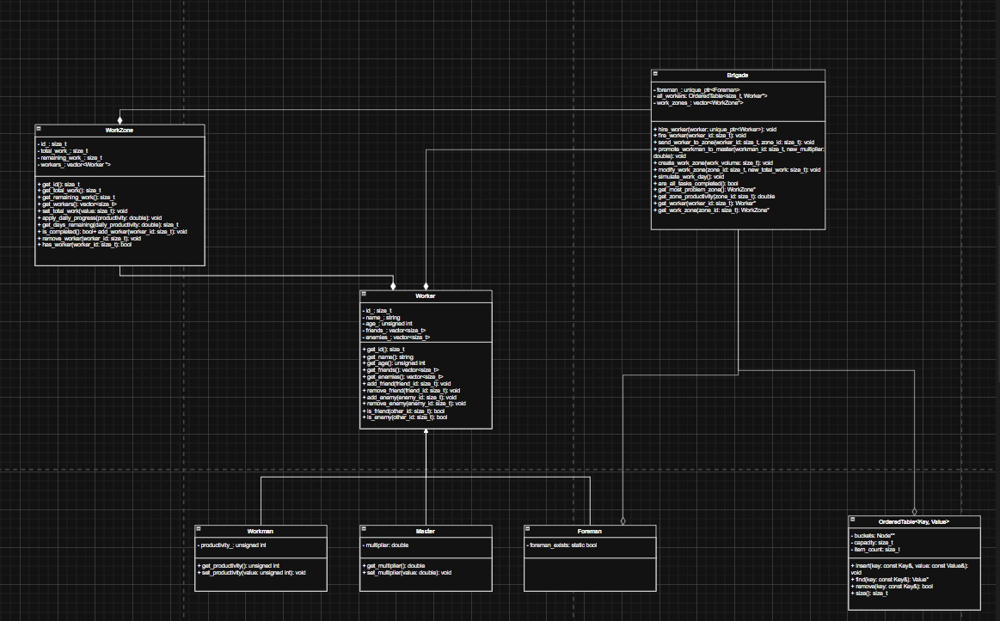
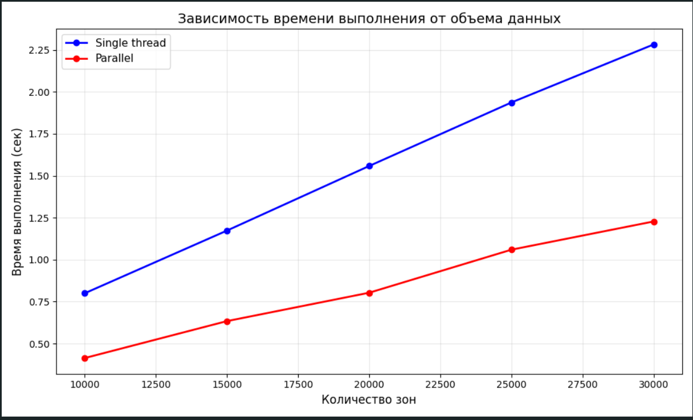

## UML-диаграмма




## Сборка проекта

```bash
mkdir cmake-build-debug-coverage
cd cmake-build-debug-coverage
cmake -DCMAKE_BUILD_TYPE=Debug -DCMAKE_CXX_FLAGS="--coverage" ..

make all
```
## Запуск консольной псевдографики
```bash
./bin/lab3
```

Запускать из папки сборки

## Вспомогательные скрипты

Автоматическая генерация отчёта о покрытии кода тестами
```bash
    ./coverage.sh
```

Автоматическая генерация документации (Doxygen)
```bash
    ./generate_docs.sh
```

P.S. Скрипты запускать из корня проекта

## Графики зависимости времени от количества входных данных



Скриншоты с запуском программы и её работой есть в папке screenshots
